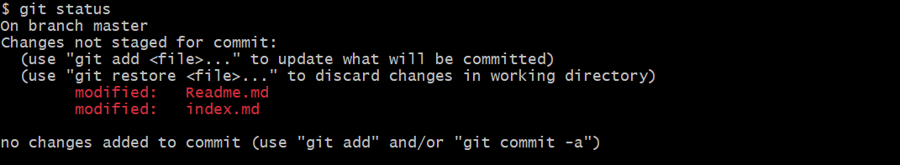
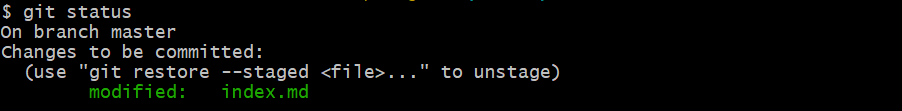

## Отмена изменений и коммитов
---
### ***Отмена изменений в рабочей директории***

Для отмены таких изменений используется команда:

`$ git restore`

Git сам напоминает об этом при проверке статуса:

#### ***Отмена индексации файла***

Для отмены индексации файла у Git тоже есть команда и он при выводе статуса напоминает нам о ней:

Теперь, если нужно, можно выполнить *git restore* и окончательно отменить изменения в выбранных файлах.

### ***Отмена коммитов***

`$ git reset --hard HEAD~`

**git reset** - мощная команда, имеющая множество различных флагов и способов работы. 

Флаг --hard означает полное удаление. Без него коммит будет отменен, но не удален (все изменения этого коммита вернутся в рабочую директорию, так что с ними можно будет продолжить работать). 

**HEAD (голова)** - так обозначается последний сделанный коммит. HEAD~ означает "один коммит от последнего коммита". Если надо удалить два последних коммита, то пишем HEAD~2 и т.д.

[Предыдущая](./historycommit.md) | [К содержанию](./readme.md) | [Следующая](./ignor.md) |