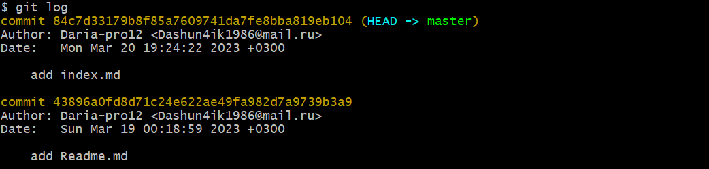

## Просмотр истории коммитов 
---
Одной из основных команд для просмотра истории коммитов является:

    $ git log

Она показывает список всех выполненных коммитов, отсортированных по дате добавления (сверху самые последние).

Чтобы просмотреть все коммиты с дифом используйте:

    $ git log -p

Мотать вперед - f, мотать назад - b, выйти из режима просмотра — q.

Команда *git log* имеет очень большое количество опций для поиска коммитов по разным критериям.

[Предыдущая](./analis.md) | [К содержанию](./readme.md) | [Следующая](./cancel.md) |