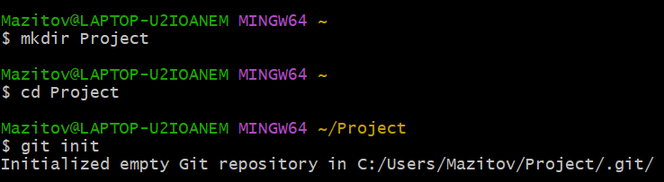
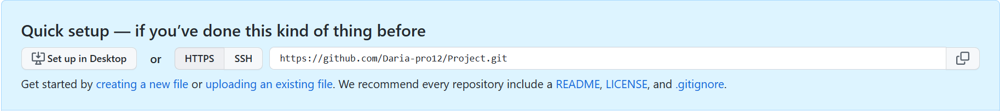

## Создание Git-репозитория
---
Репозиторий Git можно создать одним из двух способов:

1. Взять локальный каталог, который в настоящее время не находится под контролем, и превратить его в репозиторий Git.
2. Клонировать существующий репозиторий Git.

### ***Создание репозитория в существующем каталоге***

Команда | Что делает
---|---
$ mkdir Project | cоздает новый проект
$ cd Project | переходит в созданную директорию
$ git init | выполняет инициализацию

Команда git init создаёт в текущем каталоге новый подкаталог с именем .git, содержащий все необходимые файлы репозитория — структуру Git репозитория.

### ***Клонирование существующего репозитория***

В данном способе необходимо предварительно создать Git репозиторий на одном из хостингов для git-репозиториев (в нашем случае, GitHub). Для создания нажмите кнопку «New» на главной странице или на странице со списком репозиториев, введите имя репозитория и нажмите кнопку «Create repository».

Копируем ссылку и осуществляем клонирование репозитория командой 

`$ git clone url`

Эта команда создаёт директорию с названием проекта на GitHub, инициализирует в нём подкаталог .git, скачивает все данные для этого репозитория и извлекает рабочую копию последней версии.

[Предыдущая](./installation.md)| [К содержанию](./readme.md) | [Следующая](./work.md) |