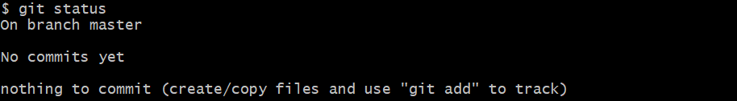
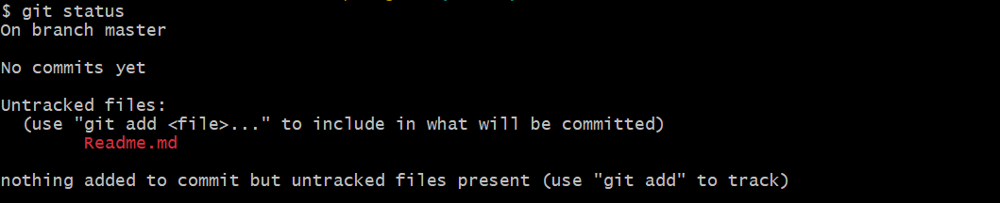
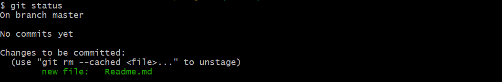
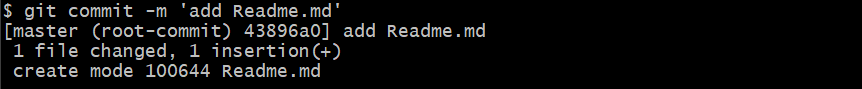

## Запись изменений в репозиторий
---
Для определения, какие файлы в каком состоянии находятся используется команда:

`$ git status`

Если выполнить эту команду сразу после клонирования, вы увидим:

Это означает, что репозиторий пустой (No commits yet) и в него нечего добавить, так как нет новых или измененных файлов.

После создания файла Readme.md:

Git увидел, что в проекте появились новые файлы, о которых ему ничего не известно. Понять, что новый файл неотслеживаемый можно по тому, что он находится в секции «Untracked files».  Git не следит за изменениями в таких файлах, так как они не добавлены в репозиторий.

Для того чтобы начать отслеживать новый файл, используется команда:

`$ git add Readme.md`

При выполнении команды status видно, что файл теперь отслеживаемый и добавлен в индекс:

Чтобы зафиксировать изменения используем:

`$ git commit -m 'add Readme.md'` 

В результате:

Коммит — это операция, которая берет все подготовленные изменения (они могут включать любое количество файлов) и отправляет их в репозиторий как единое целое. Со смысловой точки зрения, коммит — это какое-то логически завершенное изменение внутри проекта, то есть он должен выполнять ровно одну задачу.

Флаг -m означает message, то есть описание коммита. Если выполнять коммит без описания, откроется редактор, в котором нужно будет ввести описание. Необходимо делать осмысленные описания.

Теперь файл Readme.md находится внутри репозитория. Результат выполения команды git status после коммита выглядит так:

Команда git status не выводит файлы, которые добавлены в репозиторий и не содержат изменений.

[Предыдущая](./repo.md) | [К содержанию](./readme.md) | [Следующая](./gitwork.md) |